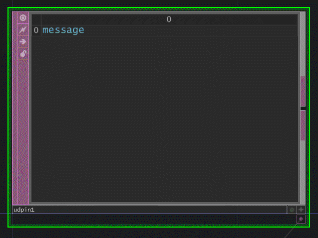
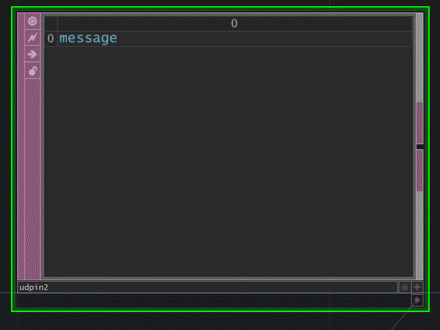

# Working with a Python Subprocess Call and TouchDesigner

At the TouchDesigner Summit in Montreal we'll be taking some time to talk about working with external Python Modules in TouchDesigner. While we'll have time to cover lots of information about how to incorporate external modules in Touch, we won't have a lot of time to talk through the wobbles that you might run into when working with operations that might be slow, or otherwise unwieldy to run in Touch. 

"What do you mean Matt?"  

The types of pieces that usually fall into this category are blocking operations. For example, let's say that you want to upload an image to the web somewhere. Many of the libraries that you might find will have an approach that's probably blocking - as in it will appear as if TouchDesigner has frozen while the whole operation completes. While this is fine outside of Touch, we don't typically like it when our applications appear to freeze - especially in installations or live performances. You might be able to move that process to another thread, though that might be a little more hassle that you really want it to be in the long run.

Enter the Python Subprocess module.

## Subprocess
The subprocess module allows you to run a python script as a parallel execution that doesn't touch your TouchDesigner application. You could use this for all sorts of interesting an powerful applications - from starting media syncing between machines, running a process that talks to the internet, or any number of solutions that execute outside of TouchDesigner. In the past I've used this for things like sending emails, or uploading images to instagram - there's lots you can do with this approach, it's just a matter of wrangling python and the subprocess module. 

What exactly is happening when we use the subprocess module?! Well, we can think of this as a situation where we write a python script in a text file, and then ask your operating system to run that file. There are great ways to pass in arguments into those situations, and if you really need data there are ways to get a response before the process quits. This can be a very flexible solution for a number of situations, and worth looking into if you want something that's non-blocking and can be run outside of TouchDesigner.

Subprocess calls can be infuriating if you're not familiar with them, so let's look at some simple anatomy of making this work from Touch.

----

## Scenario 1 - Execute this Script
Let's start with the most basic of scenarios. Here we have some Python script that normally takes a long time to run, that we just want to kick off from TouchDesigner. For this example let's just look at something that will print to a shell - nothing fancy, just a place to get our bearings. Our python script might look something like this:

### Pure Python
```python
import time
import sys

# a variable a divider that we're going to use
divider = '- ' * 10

# a for loop to print all of the paths in our sys.path
for each in sys.path:
    print(each)

# our divider
print(divider)

# a for loop that prints numbers 
for each in range(10):
    print(each)

# a call to time.sleep to keep our terminal open so we can see what's happening
time.sleep(120)
```
This works just the way that we might expect if we run it in our OS. But how can we run this script from TouchDesigner?

### In TouchDesigner
In TouchDesigner we'd add a DAT that has the following contents. Here we assume that the script above has been saved in a folder called `scripts` that's in the same folder as our project file, and the name of the script is `cmd_line_python.py`. 
```python
import subprocess

# point to our script that we're going to execute
cmd_python_script = '{}/scripts/cmd_line_python.py'.format(project.folder)

# quick debug print
print(cmd_python_script)

# call our script with subprocess
subprocess.Popen(['python', cmd_python_script], shell=False)
```
This is great, but this will actually execute with the version of Python that's packaged with TouchDesigner. In some cases that's exactly what we want... in other's we might want to use a different version of python that's installed on our OS. How can we do that?

----

## Scenario 2 - Execute this Script with a Specific Python
This is very similar to our first situation, but here we want to run the python that's installed on our OS, not the python that's packaged with Touch. In this case we can use the exact same python script we saw above.

### Pure Python
```python
import time
import sys

# a variable a divider that we're going to use
divider = '- ' * 10

# a for loop to print all of the paths in our sys.path
for each in sys.path:
    print(each)

# our divider
print(divider)

# a for loop that prints numbers 
for each in range(10):
    print(each)

# a call to time.sleep to keep our terminal open so we can see what's happening
time.sleep(120)
```

Our real changes come when we're issuing the subprocess call in TouchDesigner.

### In TouchDesigner
Again, we add a DAT that has the following contents. Here we assume that the script above has been saved in a folder called `scripts` that's in the same folder as our project file, and the name of the script is `cmd_line_python.py`. The additional wrinkle this time, is that we also need to specify which `python.exe` we want to use for this process.

```python
import subprocess

# point to our script that we're going to execute
cmd_python_script = '{}/scripts/cmd_line_python.py'.format(project.folder)

# point to the specific version of python that we want to use
python_exe = 'C:/Program Files/Python35/python.exe'

# quick debug print
print(cmd_python_script)

# call our script with subprocess
subprocess.Popen([python_exe, cmd_python_script], shell=False)
```
If we look closely at the example above, we can see that we've been very specific about where our `python_exe` lives. This approach runs the same script, only this time with the `python.exe` that we've specifically pointed to.

----

## Scenario 3 - Passing Over Args
There are several ways to approach this challenge. One that will line up with the format of many pure pythonic approaches here would be to use the `argparse` library. We find this in lots of stand-alone scripts, and it allows us the flexibility of setting default arguments, and creating some relatively clean inputs when calling a script form the command line. In this approach we set up a function that we'll call, and pass arguments into - in the example below that's our `My_python_method()`. By using `ArgumentParser` we can pass in command line arguments that we can in turn pass through to our function. Notice the syntax at the bottom to see how this works. `ArgumentParser` returns keyword arguments, which is why we use `kwargs` as the mechanism for sending args into our simple for loop. 

### Pure Python
```python
import time
import sys
import time
from argparse import ArgumentParser

def My_python_method(kwargs):

    disp_str = 'key: {} | value: {} | type: {}'
    for each_key, each_value in kwargs.items():
        formatted_str = disp_str.format(each_key, each_value, type(each_value))
        print(formatted_str)

    # keep the shell open so we can debug
    time.sleep(int(kwargs.get('delay')))

# execution order matters -this puppy has to be at the bottom as our functions are defined above
if __name__ == '__main__':
    parser = ArgumentParser(description='A simple argument input example')
    parser.add_argument("-i", "--input", dest="in", help="an input string", required=True)
    parser.add_argument("-i2", "--input2", dest="in2", help="another input", required=True)    
    parser.add_argument("-d", "--delay", dest="delay", help="how long our terminal stays up", required=False, default=10)
    
    args = parser.parse_args()
    My_python_method(vars(args))
    pass

# example
# python .\cmd_line_python_args.py -i="a string" -i2="another string" -d=15
```

Where this becomes more interesting is when we look at what's happening on the TouchDesigner side of this equation. 

### In TouchDesigner
A DAT in TouchDesigner needs to follow the same rules we established so far - we need to know what executable we're using, which file we're running, and finally we now need to send along some arguments that will be passed to that file. In Touch, our script this time should look something like this:

```python
import subprocess

# point to our script that we're going to execute
cmd_python_script = '{}/scripts/cmd_line_python_args.py'.format(project.folder)

# construct a list of arguments for out external script
script_args = ['-i', 'Hello', '-i2', 'TouchDesigner']

# join our python instructions with our scirpt args
command_list = ['python', cmd_python_script] + script_args

# call our script with subprocess
subprocess.Popen(command_list, shell=False)
```

----
## Scenario 4 - I Want a Message Back

Like all things Touch, and all things Python there are LOTS of ways to accomplish this task. One way we might want to consider, however, is using UDP messages. Touch happens to have a handy `UDPIn DAT` that's ready to accept messages, and the other benefit here is that we could potentially target another machine on our network as the target for these messages. For this first exploration let's imagine that we're only sending a message locally, and that all of our variables are defined in the python script we're running. We'll need to use the `socket` library to help with the communication elements, and you'll notice that we import that at the top of our script. This silly example just creates a UDP connection, and sends messages at a regular interval. 

### Pure Python
```python
import time
import sys
import socket

upd_ip = "127.0.0.1"
udp_port = 7000
sock = socket.socket(socket.AF_INET, socket.SOCK_DGRAM)

num_iters = 11
sleep_interval = 2

def msg_to_bytes(msg):
    return msg.encode('utf-8')

starting_msg = "Sending messages at an interval of {} seconds".format(sleep_interval)
sock.sendto(msg_to_bytes(starting_msg), (upd_ip, udp_port))

for each in range(num_iters):
    msg = "{} of {}".format(each, num_iters-1)
    sock.sendto(msg_to_bytes(msg), (upd_ip, udp_port))
    time.sleep(sleep_interval)

ending_msg = "All messages sent"
sock.sendto(msg_to_bytes(ending_msg), (upd_ip, udp_port))
```

### In TouchDesigner
For this simple execution in TouchDesigner we only need to worry about kicking off the script. That looks almost exactly like the other pieces we've set up so far.
```python
import subprocess

# point to our script that we're going to execute
cmd_python_script = '{}/scripts/cmd_line_python_udp_msg.py'.format(project.folder)

# print our script path - quick debug
print(cmd_python_script)

# clear the last entries from the UDPin DAT
op('udpin1').par.clear.pulse()

# call our script with subprocess
subprocess.Popen(['python', cmd_python_script], shell=True)
```
Our catch this time is that we nee dto use a `UDPIn DAT` to receive those messages. Let's also make sure the `Row/Callback Format` parameter is set to `One Per Message`. With this all set up we should see something like this when we kick off the script.



----

## Scenario 5 - Messages, I can has args?!
That all seems mighty fine... but, what happens when I want to combine what we've done with passing along arguments, and messages? I'm so glad you asked. With a little extra work we can make exactly that happen. We do need to do a little more heavy lifting on the python front, but that work gives us some extra flexibility. You'll notice below that we're now passing along which port we want to use, how many iterations of our for loop, and the interval between repetitions. 

### Pure Python
```python
import time
import sys
import socket
from argparse import ArgumentParser

def msg_to_bytes(msg):
    return msg.encode('utf-8')

def msg_loop(port, interval, loop):
    # localhost
    upd_ip = "127.0.0.1"

    # set udp port with input val and initialize socket connection
    udp_port = int(port)
    sock = socket.socket(socket.AF_INET, socket.SOCK_DGRAM)

    # set additional variables with input vals
    num_iters = int(loop)
    sleep_interval = int(interval)

    # send message that we're starting
    starting_msg = "Sending messages at an interval of {} seconds".format(sleep_interval)
    sock.sendto(msg_to_bytes(starting_msg), (upd_ip, udp_port))

    # run message loop
    for each in range(num_iters):
        msg = "{} of {}".format(each, num_iters-1)
        sock.sendto(msg_to_bytes(msg), (upd_ip, udp_port))
        time.sleep(sleep_interval)

    # send message that we're ending
    ending_msg = "All messages sent"
    sock.sendto(msg_to_bytes(ending_msg), (upd_ip, udp_port))

# execution order matters - this puppy has to be at the bottom as our functions are defined above
if __name__ == '__main__':
    parser = ArgumentParser(description='A simple UDP example')
    parser.add_argument("-p", "--port", dest="port", help="UDP port", required=True, default=1234)
    parser.add_argument("-i", "--interval", dest="interval", help="loop interval", required=True, default=5)
    parser.add_argument("-l", "--loop", dest="loop", help="number of repetitions", required=True, default=10)
    args = parser.parse_args()

    msg_loop(args.port, args.interval, args.loop)
    pass

# example
# python .\cmd_line_python_udp_msg_args.py -p=5000 -i=2 -l=10
```

### In TouchDesigner
Over in TouchDesigner, our subprocess script looks very similar to what we've done so far with just a few modifications.

```python
import subprocess

# set up our variables for our subprocess call
port = str(op('udpin2').par.port.val)
interval = '1'
loop = '15'

# point to our script that we're going to execute
cmd_python_script = '{}/scripts/cmd_line_python_udp_msg_args.py'.format(project.folder)

# construct a list of our python args - which python and which script
python_args = ['python', cmd_python_script]

# construct a list of arguments for out external script
script_args = ['-p', port, '-i', interval, '-l', loop]

# join our two lists - python args and scirpt args
cmd_args = python_args + script_args

# quick debug print
print(cmd_args)

# clear the last entries from the UDPin DAT
op('udpin2').par.clear.pulse()

# call our script with subprocess
subprocess.Popen(cmd_args, shell=True)
```
Here the resulting messages look veyr simlar, only we've not gotten to specify all the qualtiies about the for loop from our script.



---

## What does this Matter?
Well, there are lots of things you might do with this, but espeically interesting might be considering how you can use otherwise very costly and slow operations in Python with this approach. For example, a recent set of Style Transfer experments I was working on used this style of approach to essentially create a TouchDesigner front end / UI for a `pytorch` style transfer backned. This let me pass along arguments from the UI over to a pure python execution that didn't block or freeze touch while it was running. There are lots of ways you might get into mischief with this kind of work, and it's worth pointing out that while all this is focused on python, there's no reason you couldn't instead think of other applications you want to run with a particular file and a set of command line arguments. 

Happy Programming!